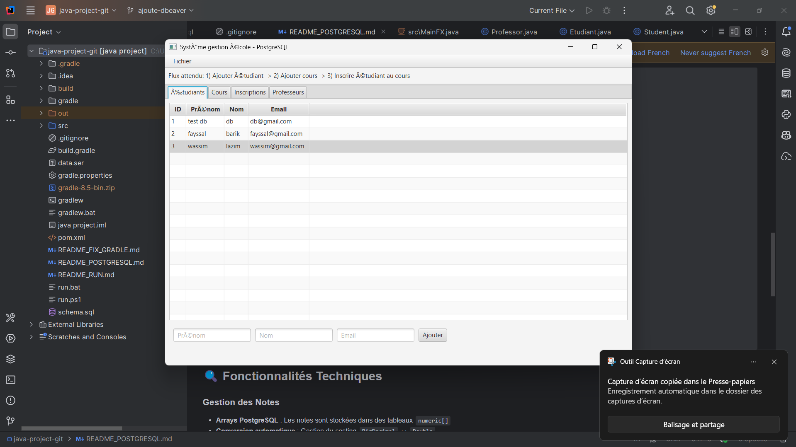
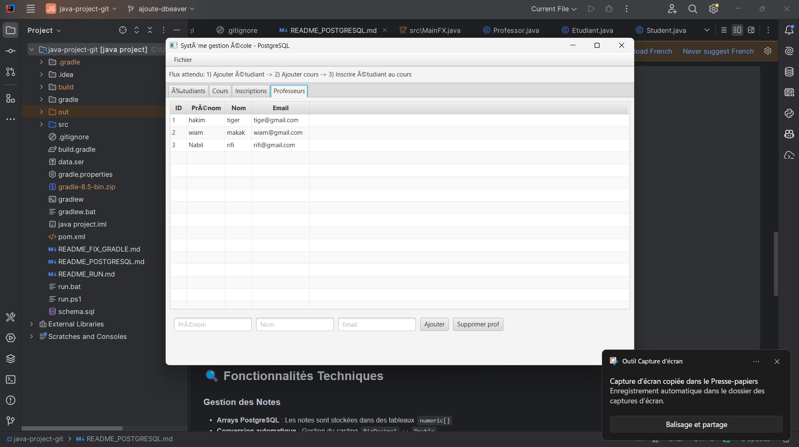
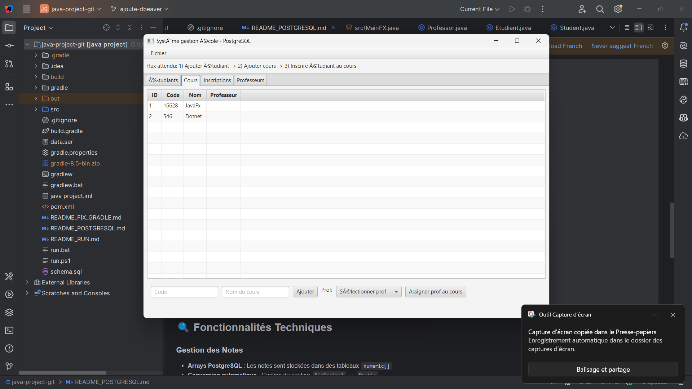
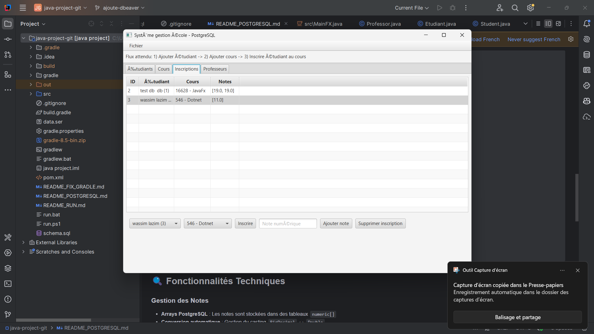
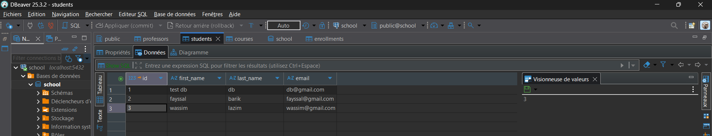
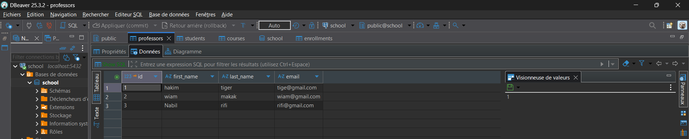
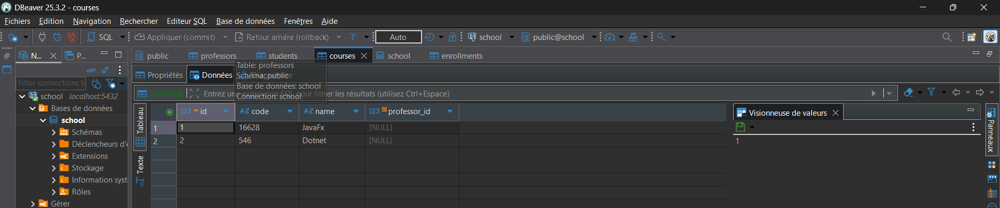
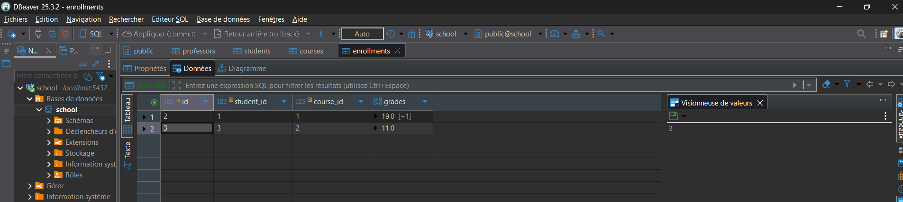

ranch# 🎓 Système de Gestion d'École - Java Project

Un système de gestion d'école complet développé en **JavaFX** avec base de données **PostgreSQL**, permettant la gestion des étudiants, professeurs, cours et inscriptions.


## 📸 Aperçu de l'interface

| Onglet Étudiants | Onglet Professeurs | Onglet Cours | Onglet Inscriptions |
|-------------------|-------------------|--------------|-------------------|
|  |  |  |  |

## 🚀 Fonctionnalités

### 👥 Gestion des Étudiants
- ✅ Ajout/Modification/Suppression d'étudiants
- ✅ Visualisation en tableau avec tri et recherche
- ✅ Formulaires de saisie intuitifs
- ✅ Validation des données

### 👨‍🏫 Gestion des Professeurs  
- ✅ Gestion complète du corps professoral
- ✅ Affichage en liste détaillée
- ✅ Modification des informations professeur

### 📚 Gestion des Cours
- ✅ Création et gestion des cours/matières
- ✅ Attribution aux professeurs
- ✅ Catalogue complet des enseignements

### 📝 Gestion des Inscriptions
- ✅ Attribution de cours aux étudiants
- ✅ Suivi des inscriptions en temps réel
- ✅ Interface graphique intuitive

## 🛠️ Architecture Technique

### Technologies utilisées
- **Frontend** : JavaFX 17 (Interface utilisateur moderne)
- **Backend** : Java 17 + JDBC (Logique métier)
- **Base de données** : PostgreSQL 16 (Persistance des données)
- **Build** : Gradle 8.5 (Gestion des dépendances)
- **IDE** : IntelliJ IDEA

### Structure de la base de données
```sql
-- Tables principales
├── students      (id, nom, prenom, email, date_naissance)
├── professors    (id, nom, prenom, email, departement) 
├── courses       (id, nom, description, professeur_id)
└── enrollments   (id, etudiant_id, cours_id, date_inscription)
```

## 📋 Prérequis

- **Java 17** ou supérieur
- **PostgreSQL 16** installé et configuré
- **Gradle 8.5** (inclus via wrapper)
- **JavaFX** (géré automatiquement par Gradle)

## ⚡ Installation et Lancement

### 1. Clonage du projet
```bash
git clone https://github.com/wiammatat/java-project.git
cd java-project
```

### 2. Configuration de la base de données
```sql
-- Créer la base de données
CREATE DATABASE school;
CREATE USER school_user WITH PASSWORD 'school_password';
GRANT ALL PRIVILEGES ON DATABASE school TO school_user;

-- Créer les tables (automatique au premier lancement)
```

### 3. Configuration de la connexion
Modifier le fichier `src/main/resources/db.properties` :
```properties
db.url=jdbc:postgresql://localhost:5432/school
db.user=school_user
db.password=school_password
```

### 4. Compilation et lancement
```bash
# Compilation
./gradlew build

# Lancement de l'application
./gradlew run
```

### 🪟 Alternative Windows
```cmd
gradlew.bat build
gradlew.bat run
```

## 📊 Captures de la base de données

La persistance des données est assurée par PostgreSQL avec les tables visibles dans DBeaver :

| Table Students | Table Professors | Table Courses | Table Enrollments |
|----------------|------------------|---------------|-------------------|
|  |  |  |  |

## 📁 Structure du projet

```
java-project/
├── src/main/java/com/example/app/
│   ├── MainFX.java              # Point d'entrée JavaFX
│   ├── Repository*.java         # Couche d'accès aux données
│   └── model/                   # Classes métier
├── src/main/resources/
│   └── db.properties           # Configuration BDD
├── assets/                     # Documentation visuelle
│   ├── *.png                   # Captures d'écran
│   └── README.md              # Guide des assets
├── build.gradle               # Configuration Gradle
└── schema.sql                # Schéma de base de données
```

## 🎯 Utilisation

1. **Lancez l'application** : `./gradlew run`
2. **Naviguez entre les onglets** : Étudiants, Professeurs, Cours, Inscriptions
3. **Ajoutez des données** : Utilisez les formulaires pour créer des enregistrements
4. **Gérez les inscriptions** : Associez les étudiants aux cours dans l'onglet dédié
5. **Visualisez en BDD** : Connectez DBeaver pour voir les données persistées

## 🔧 Développement

### Commandes utiles
```bash
# Tests
./gradlew test

# Nettoyage
./gradlew clean

# Build complet
./gradlew clean build

# Génération de la distribution
./gradlew installDist
```

### Extension possible
- 📅 Système de calendrier/planning
- 📈 Statistiques et rapports
- 🔐 Authentification et autorisations
- 📤 Export/Import de données
- 🌐 Interface web REST API

## 🤝 Contribution

1. Fork le projet
2. Créez une branche feature (`git checkout -b feature/AmazingFeature`)
3. Commit vos changements (`git commit -m 'Add some AmazingFeature'`)
4. Push vers la branche (`git push origin feature/AmazingFeature`)
5. Ouvrez une Pull Request

## 📝 Licence

Ce projet est sous licence MIT - voir le fichier `LICENSE` pour plus de détails.

## 👨‍💻 Auteur

**Wiam Matat**
- GitHub: [@wiammatat](https://github.com/wiammatat)
- Projet: [java-project](https://github.com/wiammatat/java-project)

---

**Système développé en Janvier 2026** - Projet éducatif de gestion d'école 🎓
